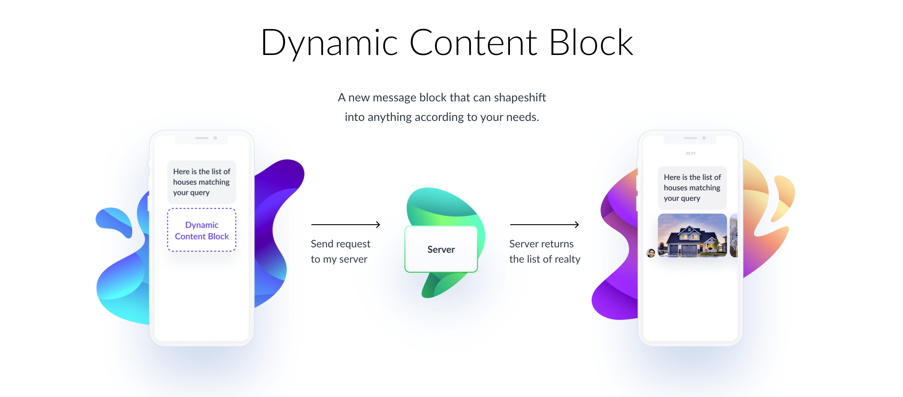

# ManyChat Block SDK

Send any message block, like text, gallery, list and others. Attach buttons with custom payloads to continue interaction.

Trigger actions in ManyChat, like tagging a user, setting a Custom Field or notifying an admin.

#### Example code:

```php
namespace App\Http\Controllers\Flow;

use ManyChat\Dynamic\Chat;
use Illuminate\Http\Request;
use App\Http\Controllers\Controller;

class WelcomeMessage extends Controller
{
    /**
     * Handle the incoming request.
     *
     * @param  \Illuminate\Http\Request  $request
     * @return \Illuminate\Http\Response
     */
    public function __invoke(Request $request)
    {
        $chat = new Chat();

        $text = new Text('Welcome to ManyChat Dynamic Response');
        $chat->reply($text);

        return $chat;
    }
}
```
#### Example response:

```json
{
    "version": "v2",
    "content": {
        "messages": [
            {
                "type": "text",
                "text": "Welcome to ManyChat Dynamic Response"
            }
        ],
        "actions": [],
        "quick_replies": []
    }
}
```

### ManyChat Docs
- [ManyChat Developer Tools](https://devtools.manychat.com/)
- [ManyChat API](https://api.manychat.com)
- [Response Reference](https://manychat.github.io/dynamic_block_docs/)

# Contents
- [Messages](#Messages)
- [Attachments](#Attachments)
- [Buttons](#Buttons)
- [Actions](#Actions)
- [Quick Reply](#Quick-Reply)

## Messages
Create a message block like Text, List or Card.

### Text
Create a `Text` message block for sending text messages.

The `Url`, `Flow`, `Node` and `Call` buttons can be used with `Text` block.

```php
$text = new Text('Example text message');

# or

$text = Text::create('Example text message');
```

### List
Create a list message block, a set of items vertically. There are two types of list `CompactList` and `LargeList`.

- `CompactList`  renders each item identically and is useful for presenting a list of items where no item is shown prominently.

- `LargeList` renders the first item with a cover image with text overlaid

The `Url`, `Flow`, `Node`, `Call` and `Buy` buttons can be used with `List` block.

> Note: We strongly suggest to use HTTPS protocol for your URLs

```php
# You need to create at lease 2 Element block
$element_1 = new Element([/* ... */]);
$element_2 = new Element([/* ... */]);

$compactList = new CompactList([$element_1, $element_2]);
$largeList = new LargeList([$element_1, $element_2]);
```

### Card
Create a horizontal scrollable gallery. There are two types of card `SquareCard` and `HorizontalCard`.

The `Url`, `Flow`, `Node`, `Call` and `Buy` buttons can be used with `Card` block.

> Note: We strongly suggest to use HTTPS protocol for your URLs

```php
# You need to create at lease 2 Element block
$element_1 = new Element([/* ... */]);
$element_2 = new Element([/* ... */]);

$horizontalCard = new HorizontalCard([$element_1, $element_2]);
$squareCard = new SquareCard([$element_1, $element_2]);
```

### Element
Create a element block. It can only be used on `List` or `Card` block.

The `Call`, `Url`, `Buy`, `Node` and `Flow` buttons can be used with `Element` block.

> Note: We strongly suggest to use HTTPS protocol for your URLs

```php
$element = new Element();
$element->title = 'Unsplash';
$element->subTitle = 'Photos for everyone';
$element->imageUrl = 'https://source.unsplash.com/random';
$element->actionUrl = 'https://unsplash.com';

# or

$element = new Element([
    'title' => 'Unsplash',
    'subTitle' => 'Photos for everyone',
    'imageUrl' => 'https://source.unsplash.com/random',
    'actionUrl' => 'https://unsplash.com',
]);
```

## Attachments
Create a attachment block like File, Image, Audio and Video.

### File
Create a file block to send any other files, which are no larger than 25 MB.

> Note: We strongly suggest to use HTTPS protocol for your URLs

```php
$file = new File('/* URL to the file */');

# or

$file = File::url('/* URL to the file */');
```

### Image
Create an image block to send an image. `Image` supports JPG, PNG and GIF images.

The `Call`, `Url`, `Buy`, `Node` and `Flow` buttons can be used with `Element` block.

> Note: We strongly suggest to use HTTPS protocol for your URLs

```php
$image = new Image('https://source.unsplash.com/random');

# or

$image = Image::url('https://source.unsplash.com/random');
```

### Audio
Create an audio block send audio files, which are no larger than 25 MB.

The `Call`, `Url`, `Buy`, `Node` and `Flow` buttons can be used with `Element` block.

> Note: We strongly suggest to use HTTPS protocol for your URLs

```php
$audio = new Audio('/* URL to the audio file */');

# or

$audio = Audio::url('/* URL to the audio file */');
```

### Video
Create an video block send video files, which are no larger than 25 MB.

The `Call`, `Url`, `Buy`, `Node` and `Flow` buttons can be used with `Element` block.

> Note: We strongly suggest to use HTTPS protocol for your URLs

```php
$video = new Video('/* URL to the video file */');

# or

$video = Video::url('/* URL to the video file */');
```

## Buttons
Create a button block like `Call`, `Url`, `Buy`, `Node` and `Flow`.

You can provide custom `Action` to be performed with the button. `Actions` can be attached to `Url`, `Flow` and `Node` button types.

### Call
Create a call button block.

```php
$call = new Call('+123456789');

# or

$call = Call::phone('+123456789');
```

### Url
Create a url button block.

```php
$url = new Url('https://example.com');

# or

$url = Url::create('https://example.com');
```

`Url` has 3 style options:

```php
use ManyChat\Dynamic\Buttons\Url;

$url = new Url('https://example.com');

$url->full()     # 100 %
    ->medium()   # 75 %
    ->compact(); # 50 %
```

### Buy
Create a buy button block.

```php
use ManyChat\Dynamic\Buttons\Buy;

$buy = new Buy('T-Shirt', 2000);

# or

$buy = Buy::create('T-Shirt', 2000);
```

You can configure the `Buy` button payment option check the code below.

```php
use ManyChat\Dynamic\Foundation\Customer;
use ManyChat\Dynamic\Foundation\Product;

$buy = new Buy();

# Update Product name and price
$buy->withProduct(function (Product $product) {
    $product->name = 'T-Shirt';
    $product->price = 2000;
});

# Update Customer requirement
$buy->withCustomer(function (Customer $customer) {
    $customer->withContactName()    # Require contact name
        ->withContactPhone()        # Require contact phone
        ->withShippingAddress();    # Require shipping address

    # or

    $customer->withoutContactName()    # Not require contact name
        ->withoutContactPhone()        # Not require contact phone
        ->withoutShippingAddress();    # Not require shipping address
});
```

### Node
Create a node button block to link with existing flow.

Node name can be found in its header, you need to use unique name for node connected with link. If there are multiple nodes with similar names inside of the same flow, transition behaviour would not meet expectations.

```php
$node = new Node('Welcome Message');

# or

$node = Node::create('Welcome Message');
```

### Flow

Create a flow button block. `Flow` block are like `Node` block, but `Flow` uses `id` of a `Node` or `Flow`.

The `id` can be found in the address bar when you're editing the node/flow.

```php
$flow = new Flow('content20180221085508_278589');

# or

$flow = Flow::create('content20180221085508_278589');
```

Example node/flow url:
```
# URL: https://manychat.com/fb152631685162536/cms/files/content20191211074127_716888

The `content20191211074127_716888` is the `id` of the node/flow.
```

## Actions
Coming soon...

## Quick Reply
Coming soon...

## License
Licensed under the [MIT](LICENSE)
